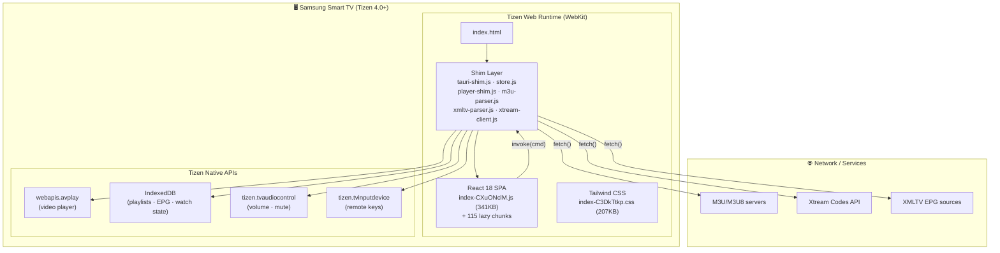
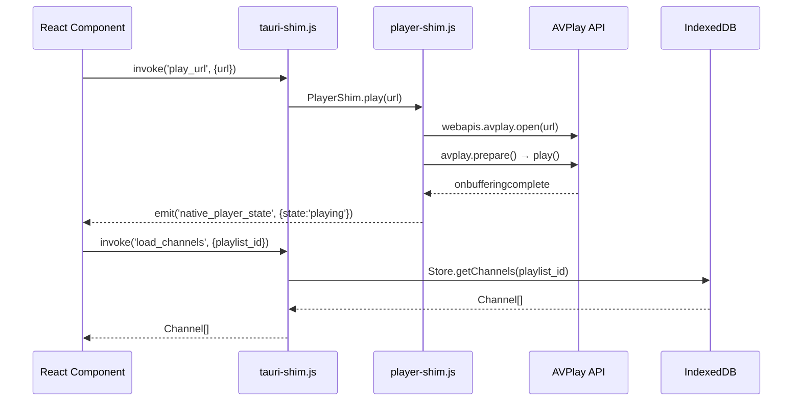
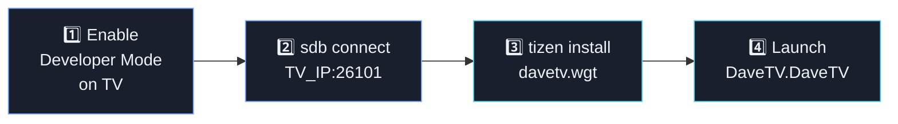
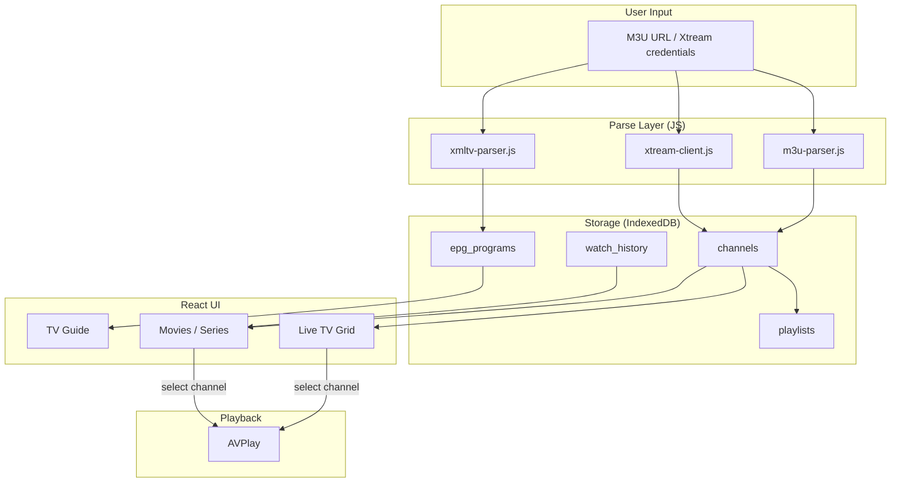

<div align="center">

<!-- DaveTV Hero SVG Banner -->
<svg xmlns="http://www.w3.org/2000/svg" viewBox="0 0 900 200" width="900" height="200">
  <defs>
    <linearGradient id="bg" x1="0%" y1="0%" x2="100%" y2="100%">
      <stop offset="0%" style="stop-color:#0f1218"/>
      <stop offset="100%" style="stop-color:#171b23"/>
    </linearGradient>
    <linearGradient id="blue" x1="0%" y1="0%" x2="100%" y2="0%">
      <stop offset="0%" style="stop-color:#77a7ff"/>
      <stop offset="100%" style="stop-color:#56d2f1"/>
    </linearGradient>
    <filter id="glow">
      <feGaussianBlur stdDeviation="4" result="blur"/>
      <feMerge><feMergeNode in="blur"/><feMergeNode in="SourceGraphic"/></feMerge>
    </filter>
    <radialGradient id="blob1" cx="20%" cy="30%">
      <stop offset="0%" style="stop-color:#7759ff;stop-opacity:0.18"/>
      <stop offset="100%" style="stop-color:#7759ff;stop-opacity:0"/>
    </radialGradient>
    <radialGradient id="blob2" cx="80%" cy="70%">
      <stop offset="0%" style="stop-color:#56d2f1;stop-opacity:0.14"/>
      <stop offset="100%" style="stop-color:#56d2f1;stop-opacity:0"/>
    </radialGradient>
  </defs>
  <rect width="900" height="200" rx="20" fill="url(#bg)"/>
  <rect width="900" height="200" rx="20" fill="none" stroke="rgba(255,255,255,0.06)" stroke-width="1.5"/>
  <ellipse cx="160" cy="80" rx="220" ry="160" fill="url(#blob1)"/>
  <ellipse cx="760" cy="130" rx="220" ry="160" fill="url(#blob2)"/>
  <!-- TV icon -->
  <g transform="translate(60,52)" filter="url(#glow)">
    <rect x="0" y="0" width="80" height="60" rx="8" fill="none" stroke="url(#blue)" stroke-width="2.5"/>
    <rect x="8" y="8" width="64" height="44" rx="4" fill="rgba(119,167,255,0.08)"/>
    <polygon points="28,18 28,50 60,34" fill="url(#blue)" opacity="0.85"/>
    <line x1="40" y1="60" x2="40" y2="76" stroke="url(#blue)" stroke-width="2.5" stroke-linecap="round"/>
    <line x1="24" y1="76" x2="56" y2="76" stroke="url(#blue)" stroke-width="2.5" stroke-linecap="round"/>
  </g>
  <!-- DAVE text -->
  <text x="168" y="108" font-family="Segoe UI,system-ui,sans-serif" font-size="78" font-weight="800" letter-spacing="-3" fill="url(#blue)" filter="url(#glow)">DAVE</text>
  <!-- TV text -->
  <text x="492" y="108" font-family="Segoe UI,system-ui,sans-serif" font-size="78" font-weight="300" letter-spacing="-2" fill="rgba(238,242,247,0.88)">TV</text>
  <!-- Tagline -->
  <text x="168" y="145" font-family="Segoe UI,system-ui,sans-serif" font-size="15" letter-spacing="4" fill="rgba(214,221,232,0.45)">LIVE  ·  MOVIES  ·  SERIES  ·  SPORTS</text>
  <!-- Version badge -->
  <rect x="686" y="60" width="110" height="28" rx="14" fill="rgba(119,167,255,0.12)" stroke="rgba(119,167,255,0.3)" stroke-width="1"/>
  <text x="741" y="79" font-family="Segoe UI,system-ui,sans-serif" font-size="12" font-weight="700" letter-spacing="1" fill="#77a7ff" text-anchor="middle">v 1.0.0</text>
  <!-- Tizen badge -->
  <rect x="686" y="98" width="110" height="28" rx="14" fill="rgba(86,210,241,0.10)" stroke="rgba(86,210,241,0.3)" stroke-width="1"/>
  <text x="741" y="117" font-family="Segoe UI,system-ui,sans-serif" font-size="12" font-weight="700" letter-spacing="1" fill="#56d2f1" text-anchor="middle">TIZEN 4.0+</text>
  <!-- Samsung badge -->
  <rect x="686" y="136" width="110" height="28" rx="14" fill="rgba(255,255,255,0.05)" stroke="rgba(255,255,255,0.12)" stroke-width="1"/>
  <text x="741" y="155" font-family="Segoe UI,system-ui,sans-serif" font-size="12" font-weight="700" letter-spacing="1" fill="rgba(238,242,247,0.6)" text-anchor="middle">SAMSUNG TV</text>
</svg>

<br/>

**DaveTV** is a fully-featured IPTV player for Samsung Smart TVs (Tizen OS).  
Forked and rebranded from IPTV Player Zero — rebuilt as a native Tizen Web App.

[](https://developer.samsung.com/smarttv)
[](https://developer.samsung.com/smarttv)
[](https://react.dev)
[](LICENSE)
[](davetv.wgt)

</div>

---

## Features

<!-- Feature grid SVG -->
<div align="center">
<svg xmlns="http://www.w3.org/2000/svg" viewBox="0 0 860 180" width="860" height="180">
  <defs>
    <linearGradient id="cardBg" x1="0%" y1="0%" x2="0%" y2="100%">
      <stop offset="0%" style="stop-color:#1a1f2e;stop-opacity:1"/>
      <stop offset="100%" style="stop-color:#12151e;stop-opacity:1"/>
    </linearGradient>
    <linearGradient id="gb" x1="0%" y1="0%" x2="100%" y2="0%">
      <stop offset="0%" style="stop-color:#77a7ff"/>
      <stop offset="100%" style="stop-color:#56d2f1"/>
    </linearGradient>
  </defs>

  <!-- Card 1: Live TV -->
  <rect x="10" y="10" width="150" height="160" rx="14" fill="url(#cardBg)" stroke="rgba(119,167,255,0.2)" stroke-width="1.2"/>
  <circle cx="85" cy="56" r="28" fill="rgba(119,167,255,0.1)" stroke="rgba(119,167,255,0.4)" stroke-width="1.5"/>
  <polygon points="74,44 74,68 100,56" fill="url(#gb)"/>
  <text x="85" y="105" font-family="Segoe UI,sans-serif" font-size="13" font-weight="700" fill="#eef2f7" text-anchor="middle">Live TV</text>
  <text x="85" y="122" font-family="Segoe UI,sans-serif" font-size="10" fill="rgba(214,221,232,0.5)" text-anchor="middle">M3U · Xtream</text>
  <text x="85" y="138" font-family="Segoe UI,sans-serif" font-size="10" fill="rgba(214,221,232,0.5)" text-anchor="middle">Stalker Portal</text>

  <!-- Card 2: EPG -->
  <rect x="175" y="10" width="150" height="160" rx="14" fill="url(#cardBg)" stroke="rgba(119,167,255,0.2)" stroke-width="1.2"/>
  <circle cx="250" cy="56" r="28" fill="rgba(119,167,255,0.1)" stroke="rgba(119,167,255,0.4)" stroke-width="1.5"/>
  <rect x="233" y="42" width="34" height="28" rx="3" fill="none" stroke="url(#gb)" stroke-width="2"/>
  <line x1="233" y1="52" x2="267" y2="52" stroke="url(#gb)" stroke-width="1.5"/>
  <line x1="240" y1="58" x2="260" y2="58" stroke="rgba(119,167,255,0.5)" stroke-width="1.5"/>
  <line x1="240" y1="64" x2="256" y2="64" stroke="rgba(119,167,255,0.5)" stroke-width="1.5"/>
  <text x="250" y="105" font-family="Segoe UI,sans-serif" font-size="13" font-weight="700" fill="#eef2f7" text-anchor="middle">TV Guide</text>
  <text x="250" y="122" font-family="Segoe UI,sans-serif" font-size="10" fill="rgba(214,221,232,0.5)" text-anchor="middle">XMLTV · EPG</text>
  <text x="250" y="138" font-family="Segoe UI,sans-serif" font-size="10" fill="rgba(214,221,232,0.5)" text-anchor="middle">7-Day Schedule</text>

  <!-- Card 3: Movies -->
  <rect x="340" y="10" width="150" height="160" rx="14" fill="url(#cardBg)" stroke="rgba(119,167,255,0.2)" stroke-width="1.2"/>
  <circle cx="415" cy="56" r="28" fill="rgba(119,167,255,0.1)" stroke="rgba(119,167,255,0.4)" stroke-width="1.5"/>
  <rect x="401" y="40" width="28" height="32" rx="2" fill="none" stroke="url(#gb)" stroke-width="2"/>
  <rect x="397" y="38" width="8" height="4" rx="1" fill="url(#gb)"/>
  <rect x="423" y="38" width="8" height="4" rx="1" fill="url(#gb)"/>
  <line x1="401" y1="48" x2="429" y2="48" stroke="rgba(119,167,255,0.4)" stroke-width="1"/>
  <text x="415" y="105" font-family="Segoe UI,sans-serif" font-size="13" font-weight="700" fill="#eef2f7" text-anchor="middle">Movies</text>
  <text x="415" y="122" font-family="Segoe UI,sans-serif" font-size="10" fill="rgba(214,221,232,0.5)" text-anchor="middle">VOD · Xtream</text>
  <text x="415" y="138" font-family="Segoe UI,sans-serif" font-size="10" fill="rgba(214,221,232,0.5)" text-anchor="middle">Watch History</text>

  <!-- Card 4: Series -->
  <rect x="505" y="10" width="150" height="160" rx="14" fill="url(#cardBg)" stroke="rgba(119,167,255,0.2)" stroke-width="1.2"/>
  <circle cx="580" cy="56" r="28" fill="rgba(119,167,255,0.1)" stroke="rgba(119,167,255,0.4)" stroke-width="1.5"/>
  <rect x="565" y="40" width="30" height="32" rx="2" fill="none" stroke="url(#gb)" stroke-width="2"/>
  <line x1="565" y1="50" x2="595" y2="50" stroke="rgba(119,167,255,0.4)" stroke-width="1"/>
  <line x1="565" y1="58" x2="595" y2="58" stroke="rgba(119,167,255,0.4)" stroke-width="1"/>
  <circle cx="572" cy="66" r="3" fill="url(#gb)"/>
  <circle cx="580" cy="66" r="3" fill="rgba(119,167,255,0.3)"/>
  <circle cx="588" cy="66" r="3" fill="rgba(119,167,255,0.3)"/>
  <text x="580" y="105" font-family="Segoe UI,sans-serif" font-size="13" font-weight="700" fill="#eef2f7" text-anchor="middle">Series</text>
  <text x="580" y="122" font-family="Segoe UI,sans-serif" font-size="10" fill="rgba(214,221,232,0.5)" text-anchor="middle">Episodes · Seasons</text>
  <text x="580" y="138" font-family="Segoe UI,sans-serif" font-size="10" fill="rgba(214,221,232,0.5)" text-anchor="middle">Progress Tracking</text>

  <!-- Card 5: Remote -->
  <rect x="670" y="10" width="150" height="160" rx="14" fill="url(#cardBg)" stroke="rgba(119,167,255,0.2)" stroke-width="1.2"/>
  <circle cx="745" cy="56" r="28" fill="rgba(119,167,255,0.1)" stroke="rgba(119,167,255,0.4)" stroke-width="1.5"/>
  <rect x="736" y="40" width="18" height="32" rx="4" fill="none" stroke="url(#gb)" stroke-width="2"/>
  <circle cx="745" cy="50" r="3" fill="url(#gb)"/>
  <line x1="740" y1="58" x2="750" y2="58" stroke="rgba(119,167,255,0.5)" stroke-width="1.5"/>
  <line x1="740" y1="64" x2="750" y2="64" stroke="rgba(119,167,255,0.5)" stroke-width="1.5"/>
  <text x="745" y="105" font-family="Segoe UI,sans-serif" font-size="13" font-weight="700" fill="#eef2f7" text-anchor="middle">TV Remote</text>
  <text x="745" y="122" font-family="Segoe UI,sans-serif" font-size="10" fill="rgba(214,221,232,0.5)" text-anchor="middle">D-Pad Navigation</text>
  <text x="745" y="138" font-family="Segoe UI,sans-serif" font-size="10" fill="rgba(214,221,232,0.5)" text-anchor="middle">Media Keys</text>
</svg>
</div>

---

## Architecture



---

## IPC Shim Flow



---

## Project Structure

```
davetv-app/
├── index.html              ← Entry point + DaveTV splash screen
├── config.xml              ← Tizen manifest (package: DaveTV.DaveTV)
│
├── js/
│   ├── tauri-shim.js       ← 80+ Tauri command → Tizen/Web API adapter
│   ├── store.js            ← IndexedDB (playlists, channels, EPG, watch state)
│   ├── player-shim.js      ← AVPlay wrapper (play/pause/seek/volume)
│   ├── m3u-parser.js       ← M3U/M3U8 parser
│   ├── xmltv-parser.js     ← XMLTV EPG parser + fuzzy channel matching
│   ├── xtream-client.js    ← Xtream Codes API client
│   └── remote-keys.js      ← TV D-pad + media keys + spatial focus navigation
│
├── css/
│   └── index-C3DkTtkp.css  ← Tailwind CSS (207 KB)
│
├── assets/
│   ├── index-CXuONclM.js   ← React 18 main bundle (341 KB)
│   └── *.js                ← 115 lazy-loaded feature chunks
│
└── images/
    ├── icon.png             ← App icon 128×128
    ├── icon-512.png         ← App icon 512×512
    └── davetv-logo.png      ← Splash logo
```

---

## Installation on Samsung TV



### Step-by-step

| Step | Action |
|------|--------|
| **1** | On TV remote: `Settings → Support → About Smart TV` → type **12345** → Enable Developer Mode → enter your PC IP |
| **2** | `sdb.exe connect <TV_IP>:26101` |
| **3** | `tizen.bat install -n davetv.wgt -t <DEVICE_ID>` |
| **4** | `tizen.bat run -p DaveTV.DaveTV -t <DEVICE_ID>` |

> `sdb.exe` is at: `C:\Users\<you>\.tizen-extension-platform\server\sdktools\data\tools\sdb.exe`

---

## Supported TV Models

| Model | Tizen | Status |
|-------|-------|--------|
| QN85Q7FAAFXZA (85" QLED) | 3.0 / 4.0 | ✅ Supported |
| QN95Q7FAAFXZA (95" QLED) | 4.0 | ✅ Supported |
| Any Samsung TV 2016+ | 3.0+ | ✅ Supported |

---

## Playlist Sources

| Source | Format | Import |
|--------|--------|--------|
| M3U URL | `.m3u` / `.m3u8` | URL import |
| Xtream Codes | API v2 | Host + user + pass |
| XMLTV EPG | `.xml` | URL import |

---

## Data Flow



---

## Tech Stack

<!-- Tech stack SVG badges -->
<div align="center">
<svg xmlns="http://www.w3.org/2000/svg" viewBox="0 0 720 60" width="720" height="60">
  <defs>
    <linearGradient id="gb2" x1="0%" y1="0%" x2="100%" y2="0%">
      <stop offset="0%" style="stop-color:#77a7ff"/>
      <stop offset="100%" style="stop-color:#56d2f1"/>
    </linearGradient>
  </defs>
  <!-- React -->
  <rect x="10" y="10" width="90" height="40" rx="10" fill="#0d1117" stroke="#61DAFB" stroke-width="1.5"/>
  <text x="55" y="35" font-family="Segoe UI,sans-serif" font-size="13" font-weight="700" fill="#61DAFB" text-anchor="middle">⚛ React 18</text>
  <!-- Tailwind -->
  <rect x="115" y="10" width="110" height="40" rx="10" fill="#0d1117" stroke="#38bdf8" stroke-width="1.5"/>
  <text x="170" y="35" font-family="Segoe UI,sans-serif" font-size="13" font-weight="700" fill="#38bdf8" text-anchor="middle">🎨 Tailwind CSS</text>
  <!-- Tizen -->
  <rect x="240" y="10" width="100" height="40" rx="10" fill="#0d1117" stroke="#1428A0" stroke-width="1.5"/>
  <text x="290" y="35" font-family="Segoe UI,sans-serif" font-size="13" font-weight="700" fill="#6b9cff" text-anchor="middle">📺 Tizen 4.0</text>
  <!-- AVPlay -->
  <rect x="355" y="10" width="100" height="40" rx="10" fill="#0d1117" stroke="rgba(119,167,255,0.4)" stroke-width="1.5"/>
  <text x="405" y="35" font-family="Segoe UI,sans-serif" font-size="13" font-weight="700" fill="url(#gb2)" text-anchor="middle">▶ AVPlay</text>
  <!-- IndexedDB -->
  <rect x="470" y="10" width="110" height="40" rx="10" fill="#0d1117" stroke="rgba(86,210,241,0.4)" stroke-width="1.5"/>
  <text x="525" y="35" font-family="Segoe UI,sans-serif" font-size="13" font-weight="700" fill="#56d2f1" text-anchor="middle">🗄 IndexedDB</text>
  <!-- Vite -->
  <rect x="595" y="10" width="110" height="40" rx="10" fill="#0d1117" stroke="#a259ff" stroke-width="1.5"/>
  <text x="650" y="35" font-family="Segoe UI,sans-serif" font-size="13" font-weight="700" fill="#a259ff" text-anchor="middle">⚡ Vite 5</text>
</svg>
</div>

---

## Building the .wgt

```bash
# Requires Python 3
python build.py

# Output: davetv.wgt (3.75 MB)
```

Or manually:
```python
import zipfile, os
with zipfile.ZipFile('davetv.wgt', 'w', zipfile.ZIP_DEFLATED) as z:
    for root, dirs, files in os.walk('davetv-app'):
        dirs[:] = [d for d in dirs if not d.startswith('.')]
        for f in files:
            full = os.path.join(root, f)
            arc = os.path.relpath(full, 'davetv-app').replace('\\', '/')
            z.write(full, arc)
```

---

## Troubleshooting

| Problem | Fix |
|---------|-----|
| White screen on load | Check browser console via sdb dlog; verify shim loads before React bundle |
| `sdb connect` refused | TV and PC must be on same network; re-enter PC IP in Developer Mode |
| No channels after import | M3U URL must be reachable from TV's network (not localhost) |
| AVPlay not found | Running in browser preview — AVPlay only works on real Samsung TV hardware |
| Remote keys not working | Check `config.xml` has `hw-key-event="true"` and `tizen.tvinputdevice` privilege |

---

## View Logs

```bash
sdb.exe -s <TV_IP>:26101 dlog | findstr "DaveTV"
```

---

<div align="center">

<!-- Footer SVG -->
<svg xmlns="http://www.w3.org/2000/svg" viewBox="0 0 600 50" width="600" height="50">
  <defs>
    <linearGradient id="fline" x1="0%" y1="0%" x2="100%" y2="0%">
      <stop offset="0%" style="stop-color:#77a7ff;stop-opacity:0"/>
      <stop offset="50%" style="stop-color:#56d2f1;stop-opacity:0.6"/>
      <stop offset="100%" style="stop-color:#77a7ff;stop-opacity:0"/>
    </linearGradient>
  </defs>
  <line x1="0" y1="1" x2="600" y2="1" stroke="url(#fline)" stroke-width="1"/>
  <text x="300" y="32" font-family="Segoe UI,sans-serif" font-size="13" fill="rgba(214,221,232,0.4)" text-anchor="middle" letter-spacing="2">DaveTV · Samsung Tizen · Built with ❤️</text>
</svg>

</div>
